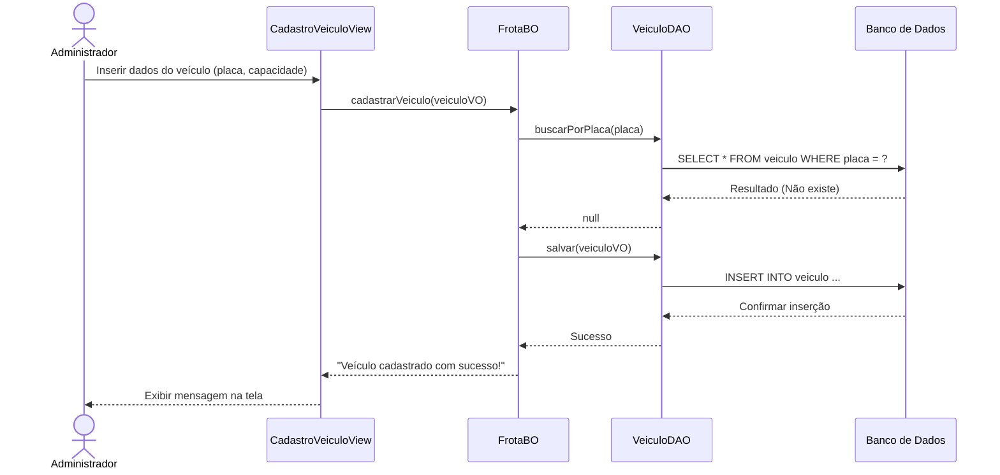
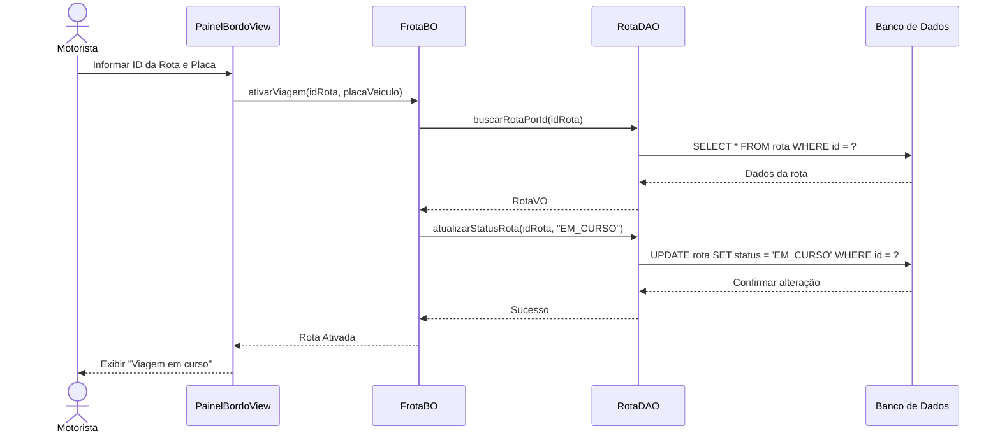
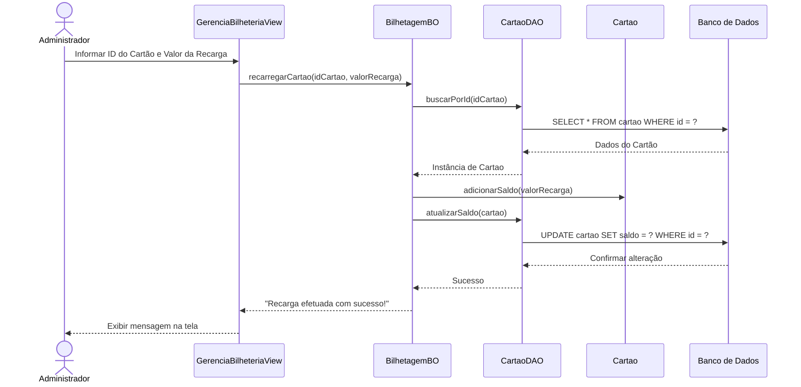
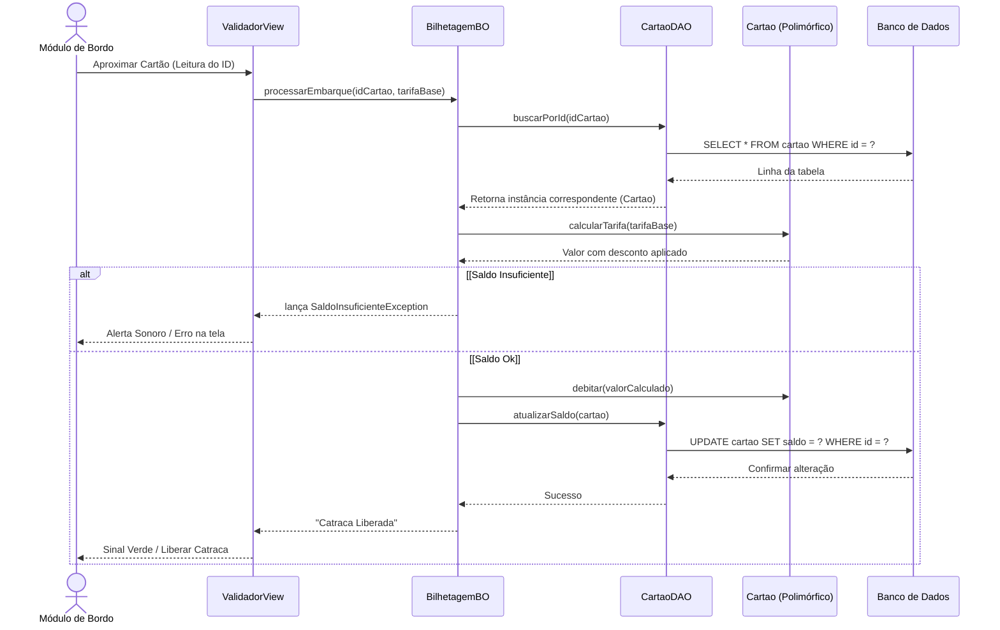
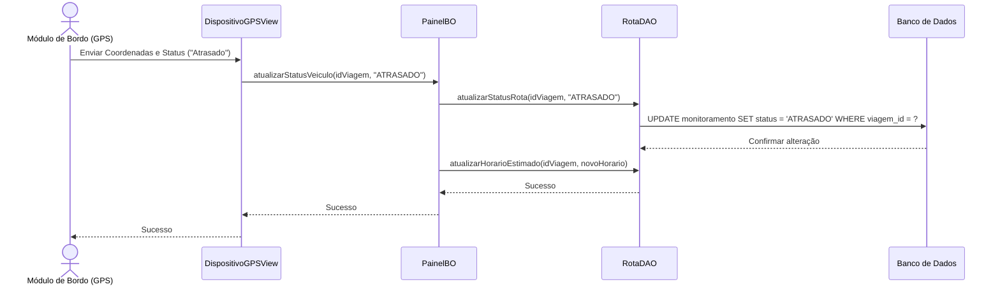
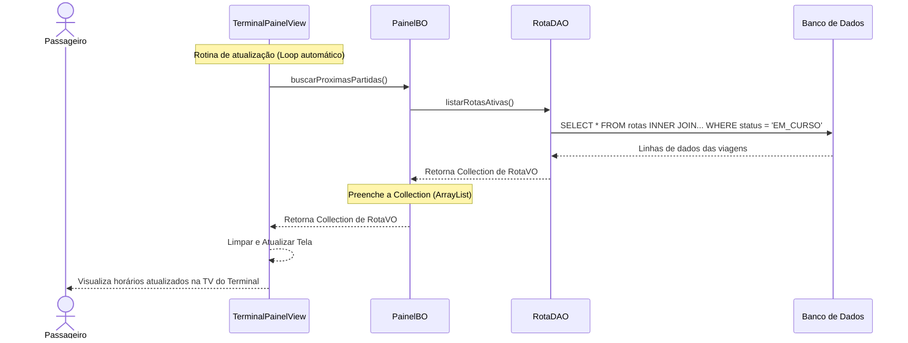

<div align="center">

<p align="center">
  
</p>

**Sistema de Gestão de Transporte Público Urbano**

*Frota · Bilhetagem Eletrônica · Monitoramento em Tempo Real*

---


</div>

---

## 📋 Visão Geral

O **Mobix** é um sistema de gestão de transporte público urbano que unifica três grandes domínios em uma única plataforma:

| Domínio | O que faz |
|---|---|
| 🚌 **Gestão Operacional de Frota e Rotas** | Cadastro, validação e ativação de veículos e rotas com controle de duplicidade via `buscarPorPlaca()` |
| 🎫 **Bilhetagem Eletrônica Inteligente** | Emissão, recarga e validação de cartões com tarifa polimórfica por perfil (`CartaoComum`, `CartaoEstudante`, `CartaoIdoso`) |
| 📡 **Módulo de Informação Dinâmica** | Rastreamento GPS em tempo real e painel estilo aeroporto com loop automático de próximas partidas nos terminais |

O sistema automatiza o ciclo completo da operação — do cadastro de veículos à liberação da catraca. Como diferencial, o **Módulo de Informação Dinâmica** integra painéis automáticos nos terminais de ônibus, exibindo horários e atualizações em tempo real de forma semelhante aos sistemas informativos utilizados em aeroportos. A arquitetura segue camadas rígidas (VIEW → BO → DAO) com persistência via JDBC e Collections (`List<String>`) para organização das paradas de rota.


---

## 👥 Equipe

- **Andrey Joshua**
- **Bruno Gabriel**
- **Henrique Cavalcanti**
- **Maryane Santos**
- **Raphael Phillipe**


Projeto acadêmico desenvolvido na disciplina de **Programação Orientada a Objetos**

---

## 🎯 Objetivos

**Geral:** Desenvolver o sistema Mobix para centralizar o gerenciamento da operação de transporte público urbano, utilizando a linguagem Java e os pilares da Programação Orientada a Objetos, integrando o controle de frota, rotas e bilhetagem a um painel informativo dinâmico.

**Específicos:**

- Cadastrar e validar veículos da frota (`placa`, `capacidade`, `tipo`) evitando duplicidades via `buscarPorPlaca()`.
- Organizar itinerários e paradas de rota utilizando **Collections** (`List<String>`) para estruturar os dados em memória.
- Ativar e monitorar viagens em tempo real, atualizando o status operacional das rotas para `EM_CURSO`.
- Emitir e recarregar cartões de transporte com persistência de saldo no banco de dados.
- Calcular tarifas **polimorficamente** com base no tipo real do cartão em tempo de execução.
- Lançar `SaldoInsuficienteException` quando o saldo do cartão for insuficiente para o embarque.
- Garantir persistência de todas as informações via **DAO** com comandos SQL e `ConnectionFactory` dedicada.
- Atualizar localização e status logístico dos veículos via Módulo de Bordo (GPS).
- Exibir painel informativo com loop automático de próximas partidas nos terminais de embarque.
- Aplicar **Testes Unitários (JUnit)** para validar as regras de cobrança e horários.


---

## 🎭 Atores

| Ator | Papel no sistema |
|---|---|
| 👨‍💼 **Administrador** | Cadastra veículos na frota; gerencia emissão e recarga de cartões de transporte. |
| 🚌 **Motorista** | Faz login no painel de bordo, informa a rota e inicia a viagem (`EM_CURSO`). |
| 📡 **Módulo de Bordo (GPS)** | Envia periodicamente coordenadas e status logístico do veículo ao sistema. |
| 🧍 **Passageiro** | Aproxima o cartão no validador para embarcar; visualiza horários no painel do terminal. |


---

## 🗂️ Épicos

### Épico 1 — Gestão Operacional de Frota e Rotas
Ciclo operacional dos veículos e rotas, do cadastro à ativação de viagem. Cobre validação de placas, verificação de duplicidade, ativação de viagens com status `EM_CURSO` e organização de itinerários com `List<String>` para as paradas da rota.

> **Funcionalidades:** Cadastro de Veículos · Ativação de Rota

### Épico 2 — Bilhetagem Eletrônica Inteligente
Gestão de cartões de transporte e processamento de embarques. Inclui emissão, recarga de saldo e validação polimórfica de tarifa por perfil do passageiro. Lança `SaldoInsuficienteException` em caso de saldo insuficiente e aciona a liberação da catraca após débito confirmado.

> **Funcionalidades:** Emissão e Recarga de Cartão · Validação de Embarque 

### Épico 3 — Módulo de Informação Dinâmica
Atualização em tempo real do status logístico dos veículos via GPS de bordo e exibição de painel estilo aeroporto nos terminais. Inclui loop automático de atualização com listagem de próximas partidas, reduzindo a incerteza do passageiro e melhorando a previsibilidade das viagens.

> **Funcionalidades:** Monitoramento de Status · Painel Informativo do Terminal


---

## 🛠️ Stack Tecnológica

| Camada | Tecnologia | Justificativa |
|---|---|---|
| **Linguagem** | Java 17 | Tipagem forte; suporte robusto a herança e polimorfismo dinâmico. |
| **Framework** | Spring Boot 3 | Configuração mínima, injeção de dependência e suporte nativo a REST. |
| **Persistência** | PostgreSQL 15 + JPA + Hibernate | ORM maduro com suporte a herança de entidades. |
| **Build** | Maven 3.9 | Gerenciamento de dependências e ciclo de build padronizado. |
| **Testes** | JUnit 5 + Mockito | TDD com mocks para BO/DAO sem banco real nos testes unitários. |
| **Validação** | Jakarta Bean Validation | Anotações `@NotNull`, `@Pattern` etc. nas entidades e VOs. |

---

## 🏗️ Arquitetura em Camadas

O sistema adota um padrão arquitetural rígido em quatro camadas com responsabilidades bem definidas. Modificações na interface ou no banco não afetam as regras de negócio.

```
┌─────────────────────┐     VOs transitam      ┌─────────────────────┐     VOs transitam     ┌─────────────────────┐
│        VIEW         │ ──────────────────────►│         BO          │ ─────────────────────►│        DAO          │
│   (Apresentação)    │     Ex: VeiculoVO      │  (Regras de Negócio)│     Ex: CartaoVO      │  (Acesso a Dados)   │
│                     │ ◄──────────────────────│                     │ ◄─────────────────────│                     │
└─────────────────────┘      RotaVO            └─────────────────────┘      RotaVO           └──────────┬──────────┘
                                                                                                        │   ▲
                                                                                               Query SQL│   │ ResultSet
                                                                                                        ▼   │
                                                                                             ┌─────────────────────┐
                                                                                             │    BANCO DE DADOS   │
                                                                                             │     (Relacional)    │
                                                                                             │  TB_VEICULO         │
                                                                                             │  TB_CARTAO          │
                                                                                             │  TB_ROTA            │
                                                                                             │  TB_MONITORAMENTO   │
                                                                                             └─────────────────────┘
```

| Camada | Responsabilidade |
|---|---|
| **VIEW** | Interface com o ator. Captura entradas e exibe resultados — sem cálculos ou acesso ao banco. |
| **BO** | Cérebro do sistema. Centraliza validações, cálculo polimórfico de tarifa, verificação de saldo e orquestração da persistência. |
| **DAO** | Comunicação exclusiva com o banco. Traduz operações em SQL (CRUD) e instancia VOs polimorficamente com base nos dados retornados. |
| **VO** | Transportadores de dados entre camadas. `CartaoVO` possui subclasses polimórficas com `calcularTarifa()` sobrescrito. |

---

## Diagrama de Classes

```mermaid
classDiagram

%% ─── Usuário / Autenticação ───────────────────────────────────────────────

    class Usuario {
        -login: String
        -senha: String
        +Usuario(String login, String senha)
    }

    class Autenticavel {
        <<Interface>>
        +autenticar(String login, String senha) boolean
    }

    class Administrador {
        +autenticar(String login, String senha) boolean
    }

    class Motorista {
        -cnh: String
        +autenticar(String login, String senha) boolean
    }

    Usuario <|-- Administrador : Herança
    Usuario <|-- Motorista     : Herança
    Autenticavel <|.. Administrador : Implementa
    Autenticavel <|.. Motorista     : Implementa

%% ─── Bilhetagem ───────────────────────────────────────────────────────────

    class GerenciaBilheteiraView {
        -bilhetagemBO: BilhetagemBO
        +renderizarMenu() void
    }

    class ValidadorView {
        -bilhetagemBO: BilhetagemBO
        +lerCartaoFisico() void
    }

    class SaldoInsuficienteException {
        <<exception>>
        +SaldoInsuficienteException(String mensagem) void
    }

    class BilhetagemBO {
        -cartaoDAO: CartaoDAO
        +recarregarCartao(int id, double valor) void
        +processarEmbarque(int id, double tarifaBase) boolean
    }

    class CartaoDAO {
        +buscarPorId(int id) Cartao
        +atualizarSaldo(Cartao cartao) boolean
    }

    class Cartao {
        <<abstract>>
        -id: int
        -saldo: double
        -titular: String
        +Cartao(int id, double saldo, String titular)
        +adicionarSaldo(double valor) void
        +debitar(double valor) void
        +calcularTarifa(double tarifaBase) double
        +getId() int
        +getSaldo() double
    }

    class CartaoComum {
        +CartaoComum(int id, double saldo, String titular)
        +calcularTarifa(double tarifaBase) double
    }

    class CartaoEstudante {
        +CartaoEstudante(int id, double saldo, String titular)
        +calcularTarifa(double tarifaBase) double
    }

    class CartaoIdoso {
        +CartaoIdoso(int id, double saldo, String titular)
        +calcularTarifa(double tarifaBase) double
    }

    GerenciaBilheteiraView ..> BilhetagemBO : Depende
    ValidadorView          ..> BilhetagemBO : Depende
    BilhetagemBO           ..> CartaoDAO    : Depende
    BilhetagemBO ..> SaldoInsuficienteException : Lança
    CartaoDAO               o-- Cartao      : Manipula (Polimorfismo)
    Cartao <|-- CartaoComum    : Herança
    Cartao <|-- CartaoEstudante: Herança
    Cartao <|-- CartaoIdoso    : Herança

%% ─── Frota / Veículo ─────────────────────────────────────────────────────

    class CadastroVeiculoView {
        -frotaBO: FrotaBO
        +exibirFormulario() void
    }

    class PainelBordoView  {
        -frotaBO: FrotaBO
        + informarRota(int idRota, String placaVeiculo) : void
        + exibirStatusViagem(String status) : void
    }

    class FrotaBO {
        -veiculoDAO: VeiculoDAO
        -rotaDAO: RotaDAO
        +cadastrarVeiculo(VeiculoVO veiculo) void
        +ativarViagem(int idRota, String placa) void
    }

    class VeiculoDAO {
        +salvar(VeiculoVO veiculo) boolean
        +buscarPorPlaca(String placa) VeiculoVO
    }

    class VeiculoVO {
        -placa: String
        -capacidade: int
        -tipo: String
        +VeiculoVO(String placa, int capacity, String tipo)
        +getPlaca() String
        +getCapacidade() int
    }

    CadastroVeiculoView ..> FrotaBO   : Depende
    FrotaBO             ..> VeiculoDAO: Depende
    FrotaBO             ..> RotaDAO   : Depende
    PainelBordoView ..> FrotaBO : Depende
    VeiculoDAO           o-- VeiculoVO: Manipula
    VeiculoVO <|-- CartaoIdoso         : Herança

%% ─── Rota / Painel ───────────────────────────────────────────────────────


    class DispositivoGPSView {
        -painelBO: PainelBO
        +enviarStatus(int id, String status)
    }

    class TerminalPainelView {
        -painelBO: PainelBO
        +atualizarPainelAutomatico() void
    }

    class PainelBO {
        -rotaDAO: RotaDAO
        +atualizarStatusVeiculo(int idViagem, String status) void
        +buscarProximasPartidas() List~RotaVO~
    }

    class RotaDAO {
        +buscarRotaPorId(int id) RotaVO
        +atualizarStatusRota(int id, String status) boolean
        +atualizarHorarioEstimado(int idViagem, String horario) : boolean
        +listarRotasAtivas() : List<RotaVO>
    }

    class RotaVO {
        -id: int
        -nomeLinha: String
        -status: String
        -paradas: List~String~
        +RotaVO(int id, String nomeLinha)
        +adicionarParada(String parada) void
        +getParadas() List~String~
        +getStatus() String
        +setStatus(String status) void
        +setHorarioEstimado(String horario) : void
        +getHorarioEstimado() : String
    }

    class ListString["List~String~"]

    TerminalPainelView ..> PainelBO : Depende
    DispositivoGPSView ..> PainelBO : Depende
    PainelBO           ..> RotaDAO  : Depende
    RotaDAO             o-- RotaVO  : Manipula (Collections)
    RotaVO             --> ListString : Usa Collection (List)
```



---

## 🔄 Diagramas de Sequência

### Épico 1 · Funcionalidade 1 — Cadastro de Veículo




### Épico 1 · Funcionalidade 2 — Ativação de Rota




### Épico 2 · Funcionalidade 1 — Emissão e Recarga de Cartão




### Épico 2 · Funcionalidade 2 — Validação de Embarque




### Épico 3 · Funcionalidade 1 — Monitoramento de Status



### Épico 3 · Funcionalidade 2 — Painel Informativo




---


